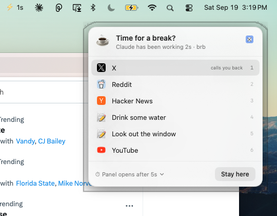
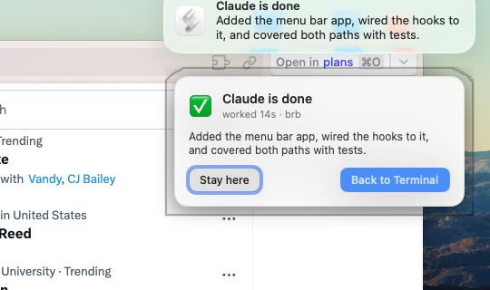
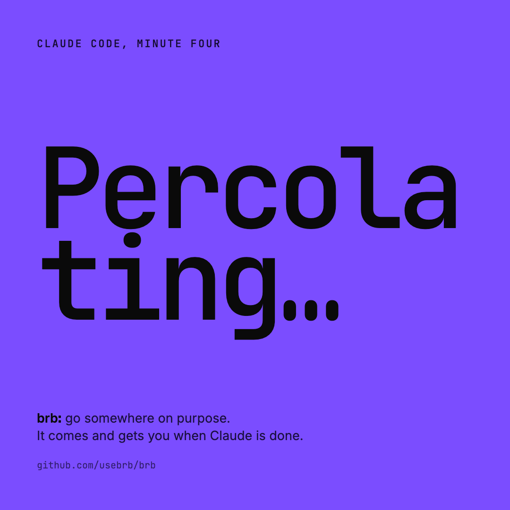

# brb

When Claude works, brb offers a break. When it finishes, brb calls you back.

It hangs off Claude Code's own lifecycle hooks: no AI, no polling, no terminal
scraping. macOS only.

Two halves, and the first one is all you need:

- **The hooks.** Installed as a Claude Code plugin. They decide everything: when a
  turn has run long enough to be worth interrupting, whether you actually left, and
  whether a finished turn has earned a callback.
- **The menu bar app** (optional). Draws the panel and the callback natively, with
  real site logos, and keeps a running count of the turn in the menu bar. Without it
  the hooks draw the same decisions in AppleScript.






## Install

As a Claude Code plugin, with nothing written to your `settings.json`:

```sh
claude plugin marketplace add usebrb/brb
claude plugin install brb@brb
```

Then `/reload-plugins`, or start a new session. `/plugin` toggles it on and off.

That is the whole install. The plugin ships the hooks, which is all brb needs.

Optionally, add the `brb` command to your shell for `brb park`, `brb windows`,
`brb timer`, `brb matrix` and `brb log`:

```sh
curl -fsSL https://raw.githubusercontent.com/usebrb/brb/main/install-cli.sh | bash
```

That installs a small wrapper which runs whichever plugin version is currently
installed, so the command and the hooks never drift apart. A plugin's `bin/` joins
the Bash tool's PATH rather than your shell's, which is why this step exists.

Config, item list and logs live in `~/.claude/brb/` and are shared by both.

<details>
<summary>Installing without the plugin manager</summary>

`./install.sh` writes the hooks straight into `~/.claude/settings.json` (backing it up
first) and links the CLI. Use this only if you are not using the plugin: running both
registers the hooks twice and everything fires twice. `./uninstall.sh` reverses it.
</details>

macOS only. On other platforms the hooks exit immediately and do nothing.

## The menu bar app

The hooks can draw their UI two ways. Out of the box it is AppleScript, which needs
nothing installed but looks like a system prompt from 2005. Build the menu bar app and
the same hooks draw a native panel instead, with icons, hover, number keys and a
callback card you can read at a glance:

```sh
brb app build      # needs Xcode command line tools
brb app install    # copies it to /Applications and starts it
```

Look for ☕️ in the menu bar. It turns into ⚡️ with a running count while Claude works,
🔔 when Claude needs you, and ✅ when a turn lands. The menu holds the same break list,
the timer and the on/off switch, so you rarely need the CLI.

Each site in the list gets its own logo. The app fetches it from that site once
(`https://<site>/apple-touch-icon.png`, then `/favicon.ico`) and caches it under
`~/.claude/brb/state/icons/`. No favicon service sits in the middle, so the only server
that learns what is on your list is the one you were about to visit. An emoji at the
start of a label is used until the logo arrives, and forever if the fetch fails. To turn
fetching off entirely: `touch ~/.claude/brb/no-icons`.

Nothing depends on the app. The hooks ask it first over a unix socket at
`~/.claude/brb/state/ui.sock`; if it isn't running, or if you set `BRB_UI=0`, they fall
back to AppleScript and behave exactly as before. `brb app` says which path is live.

The app is ad-hoc signed, so it is for people who build it themselves. A notarized
build for `brew install --cask` is the next step.

### One brb at a time

The hooks and the app are versioned together. If the installed plugin is older than the
app — the usual state when you are working on brb itself — real turns draw the
AppleScript panel while `brb panel` draws the new one, and it looks like two different
programs. `brb doctor` names every registered copy and warns when they disagree.

To run a checkout instead of the published plugin: disable it with `/plugin`, then
`./install.sh` from the checkout. Reverse it with `./uninstall.sh`.

## Tests

```sh
test/run.sh              # everything
swift test --package-path app   # the app on its own
test/hooks.test.sh       # the hooks, end to end, against a throwaway config
test/cli.test.sh         # the brb command
```

The hook tests run the real hook scripts against a temporary `BRB_CONF`, with the app
started and stopped around them, and cover both paths: what happens with the app
running, and what happens without it. Your own config, item list and log are never
touched.

### Works wherever Claude Code runs

Claude Code shares one configuration across its local surfaces, so a user-scope
install covers the CLI, the Desktop app, VS Code and JetBrains at once. There is
nothing extra to install per surface.

The host app is never assumed to be a terminal. brb walks up the process tree to
whichever `.app` owns the session and stores its bundle id, so "Back to work" raises
Terminal from a terminal session, the Claude app from a Desktop session, and VS Code
from an editor session. The CLI still needs a real shell, which on Desktop means the
integrated terminal.

## What fires, and when

Two independent things.

**The break panel** is a native list you pick from. It fires on one condition: a turn
passed the break timer (default 10s). It shows whether or not you're at the terminal,
because offering the break is its whole job.

**The alerts** are a sound, a banner, and a dialog with a *Back to work* button.

| Situation | Panel | Alert |
|---|---|---|
| Turn finishes faster than the timer | no | no |
| Long turn, panel shown, you ignored it | yes | no |
| Long turn, you clicked a note item | yes | no |
| Long turn, you clicked a site | yes | **done + Back to work** |
| Claude is blocked on you and you're away | no | **"Claude needs you"** |
| Another Claude session still busy | stays up | your alert still fires |

Clicking a site is the whole condition. You're called back whether or not you
happen to be looking at the browser when the turn ends. Also requiring you to still
be away made it a coin flip: glance at the terminal for two seconds at the wrong
moment and the alert was silently dropped. Set `REQUIRE_AWAY=1` in `config.sh` for
the stricter behaviour.

The callback still requires you to have **actually left through the panel**. Seeing the panel
and dismissing it doesn't count, and neither does a `note:` item. Those don't take you
anywhere, so there's nothing to call you back from.

Anything where Claude is *blocked on you* is deliberately exempt from that rule:
a permission prompt, a question, a link it needs opened. Gating those would mean
stalling in silence. They still stay quiet if you're at the terminal, since you can
already see them.

## Testing without a real turn

```sh
brb panel              # the real panel, right now
brb alert              # the real callback, right now
brb attention          # a "Claude needs you" ping
brb demo 20            # full flow: pick a site, then the callback 20s later
brb matrix             # every decision path, printed, NO UI drawn
```

`brb matrix` is the fast one. It runs each branch with `BRB_DRY=1` and prints what
each would have done, so you can check the logic without a single popup.

### Recording a demo

```sh
brb film prep          # short list, 3s timer, desktop icons hidden, prints a checklist
brb film take 100      # a real 100s turn through the real hooks: panel at 3s, callback at the end
brb film restore       # your list, timer and desktop back
```

Nothing in the take is staged: the panel and the callback are the ones a real turn
draws. Turn on Grayscale under Accessibility → Display → Color Filters if you want
the monochrome look, and off again after.

## Day to day

```sh
brb status             # config, live sessions, what's armed
brb log -f             # follow the decision log
brb timer 45s          # or set it from the panel's ⏱ row
brb items              # edit the panel list
brb off / brb on       # kill switch
brb doctor             # check the install
```

## How "away" is decided

The terminal that owns a session is found by walking the process tree
(`hook → claude → shell → Terminal.app`) and stored as a bundle id. That's a fact about
who owns the session, not a guess about what happened to be focused when the hook ran.
An earlier version used frontmost-app and would mis-record the terminal if you tabbed
away at the wrong instant.

Bundle ids are compared case-insensitively: System Events and LaunchServices disagree
on case for the same app.

## Adding your own places

Edit `~/.claude/brb/items.txt`, or pick **➕ Add your own…** at the bottom of the
panel, which opens [CONTRIBUTING.md](CONTRIBUTING.md), where the format is documented
and PRs against the default list are welcome.

Item icons are emoji or unicode glyphs. Color emoji render fine, but you can't
supply an image file, so real brand marks aren't available, and Unicode has no
X/Twitter glyph at all. A per-item logo would need a different UI surface.

## Configuration

- `~/.claude/brb/items.txt`: your panel list. Created the first time you run
  `brb items` or pick **Add your own…** in the panel. Format is `Label|target`,
  where target is a URL, an `app://` scheme, or `note:some text`.

  Until you make one, the panel reads the list shipped with the plugin, so you keep
  getting new default items as they are added. Once your copy exists it takes over
  and updates leave it alone. Never edit the copy inside the plugin directory,
  which is replaced wholesale on every update.
- `~/.claude/brb/config.sh`: optional overrides (sounds, titles).
- `~/.claude/brb/state/`: runtime state and `brb.log`.

## Multiple monitors

AppleScript dialogs take no position and default to the **main** display, the one
with the menu bar, which is the wrong screen whenever you're working elsewhere.
`brb` positions every dialog on the **owning terminal's** window, so the panel, the
callback, and the terminal that "Back to work" raises all land on one screen.
Anchoring to the frontmost window instead proved unreliable during screen
recordings, where focus jumps between displays.

Your browser is left where it lives. `MOVE_BROWSER=1` in `config.sh` will drag it
onto the terminal's display when you take a break, but on a single display that
means it lands directly on top of the terminal, so it's off by default.

Notification *banners* can't be positioned at all. macOS always draws them on the
display holding the menu bar. Move the menu bar in System Settings → Displays if
they appear on the wrong screen.

That reposition needs Accessibility permission. Without it everything still works,
the dialogs just land on the main display. Grant it under System Settings →
Privacy & Security → Accessibility for your terminal app.

## Notes

Notification banners need permission for "Script Editor" under System Settings →
Notifications. A sound plays regardless, so you're never left with no signal.

Hooks are registered `async: true` and never block a turn. Their timeouts are generous
only because they cap how long the detached children (the break timer and the callback
dialog) are allowed to live.
