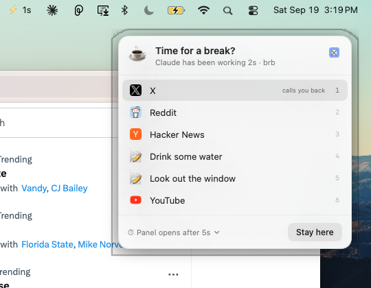
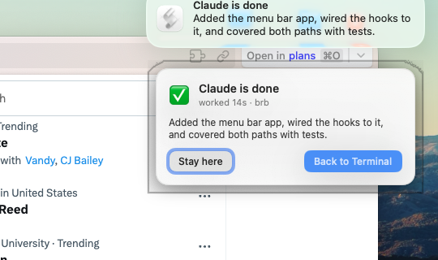

# brb

When Claude works, brb offers a break. When it finishes, brb calls you back.

A Claude Code plugin plus a small macOS menu bar app. It runs on Claude Code's own
lifecycle hooks: no AI, no polling, no terminal scraping.




## How it works

1. You send Claude a prompt that takes a while.
2. After 10 seconds, a break panel offers somewhere to go: X, Reddit, Hacker News, or
   anything you add.
3. Pick one and go. When Claude finishes, a **Claude is done** card finds you there.
   One click on **Back to Terminal** puts you right where you left off.

If you never leave through the panel, brb stays quiet when the turn ends. If Claude
gets blocked on you while you're away (a permission prompt, a question), you get a
"Claude needs you" ping.

The menu bar shows ☕️ when idle, ⚡️ with a running count while Claude works, and ✅
when a turn lands.

## Install

One line in Terminal:

```sh
claude plugin marketplace add usebrb/brb && claude plugin install brb@brb
```

Then start a new Claude Code session. On that first session the plugin downloads
its menu bar app from this repo's
[latest release](https://github.com/usebrb/brb/releases/latest) into
`/Applications` and starts it. Look for ☕️ in the menu bar. That's all.

You can also install from inside Claude Code: `/plugin marketplace add usebrb/brb`,
then `/plugin install brb@brb`.

macOS 14 or later. On other platforms the hooks exit and do nothing.

**Updates** come through Claude Code's plugin updates. When the plugin moves to a
new version, the next session swaps the app for the matching release. It waits if
a turn is running.

**Building the app yourself?** Put `AUTO_APP=0` in `~/.claude/brb/config.sh` and
the plugin never touches it. Then:

```sh
git clone https://github.com/usebrb/brb && cd brb
./brb app install      # builds it, copies it to /Applications, starts it
```

**The `brb` command** is optional, for the timer, your list and diagnostics:

```sh
curl -fsSL https://raw.githubusercontent.com/usebrb/brb/main/install-cli.sh | bash
```

## Use

Most of it lives in the menu bar app: your break list, the timer, and **Pause brb**.
From the shell:

```sh
brb status        # what's installed, running and armed
brb timer 45s     # how long a turn runs before the panel (10, 45s, 2m, 1m30s)
brb items         # edit your break list
brb doctor        # check the install
brb log -f        # follow the decision log
```

To try it without waiting on a real turn:

```sh
brb panel         # show the break panel now
brb alert         # show the "Claude is done" card now
```

### Your break list

`brb items` opens `~/.claude/brb/items.txt`. There's one item per line:

```
Label|target
```

| target | what happens |
|---|---|
| `https://…` | opens in your browser, and brb calls you back |
| `someapp://…` | opens that app, and brb calls you back |
| `note:some text` | shows a short reminder; you haven't left, so there's no callback |

Each site gets its real logo, fetched once from the site itself and cached locally.
To turn that off, run `touch ~/.claude/brb/no-icons`.

### Configuration

Everything lives in `~/.claude/brb/`:

- `items.txt`: your break list
- `config.sh`: optional overrides, like sounds, titles, `REQUIRE_AWAY=1` (only call
  back if you're still away when the turn ends) and `AUTO_APP=0` (leave the app alone)
- `state/brb.log`: what brb decided and why

It works wherever Claude Code runs: the CLI, the Desktop app, VS Code and JetBrains.
**Back to Terminal** returns you to whichever app owns the session.

## Build on it

```
hooks/        the Claude Code hooks: turn starts, turn ends, Claude needs you
lib/          shared shell helpers and the break timer
app/          the menu bar app (Swift)
brb           the CLI
share/        the default break list
test/         shell and app tests
```

To run your checkout instead of the published plugin, for one session:

```sh
claude --plugin-dir /path/to/brb
```

After an edit, run `/reload-plugins`. To rebuild the app, run `./brb app build`.

To run the tests:

```sh
test/run.sh       # everything: syntax, app unit tests, hooks end to end, CLI
./brb matrix      # every alert decision, printed, with no UI drawn
```

The tests use a throwaway config and never touch yours.

## Contributing

PRs are welcome: new places for the default list, fixes, and ideas.
[CONTRIBUTING.md](CONTRIBUTING.md) covers the list format, how to test a change
without a real Claude turn, and the alert rules to keep in mind.

## License

[MIT](LICENSE)
